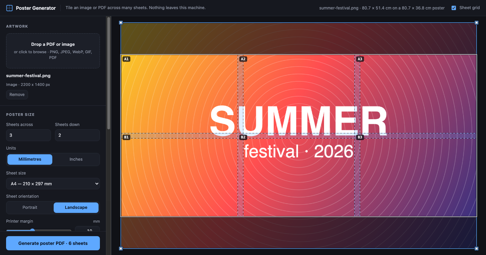
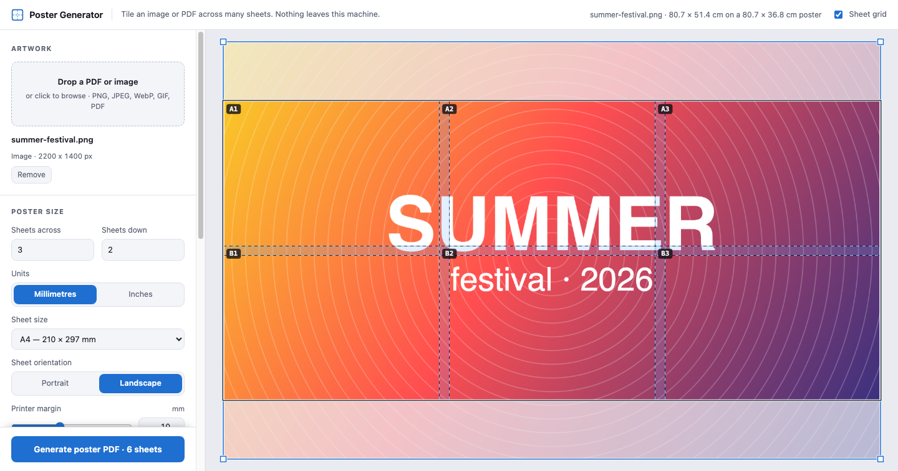

# Poster Generator

[](https://github.com/sorny/poster-generator/actions/workflows/ci.yml)
[](https://github.com/sorny/poster-generator/releases)
[](LICENSE)

Poster Generator makes a large poster from one image or one PDF page. It divides
the poster across many printable sheets, and it exports one PDF with one page for
each sheet.

Everything runs in your browser on your own machine. There are no uploads, no
network calls, and no telemetry. When Wi-Fi is off, the page still works.

**[Open the app →](https://sorny.github.io/poster-generator/)**

| Dark | Light |
|---|---|
|  |  |

The theme follows your operating system. One header bar carries the name on the
left, and the live state of the poster on the right.

## Contents

- [Run it on your machine](#run-it-on-your-machine)
- [What it does](#what-it-does)
- [How the tiling works](#how-the-tiling-works)
- [Tests](#tests)
- [Layout](#layout)
- [How to print the poster](#how-to-print-the-poster)

## Run it on your machine

```bash
npm start          # serves http://localhost:8173
```

`npm start` runs a Node static server on `127.0.0.1`. The server has no
dependencies. Any other static server also works, for example
`python3 -m http.server 8173`.

The app is built from ES modules. Browsers refuse to load ES modules over
`file://`, thus a local server is necessary.

`npm install` is optional. The app includes pdf.js and pdf-lib in `vendor/`. To
get new versions of these two libraries, do these steps:

1. Run `npm install`.
2. Run `npm run vendor`. This command copies the new builds into `vendor/`.

## What it does

**Artwork.** The app accepts PNG, JPEG, WebP, GIF, and PDF files. A PDF with more
than one page gets a page picker. PDF artwork stays vector in the exported file,
thus it is sharp at all poster sizes.

**Poster size.** You select the number of sheets across and down, the sheet size,
and portrait or landscape. The panel shows the dimensions of the finished poster.

Sheet presets include ISO A5 to A2 and seven US sizes: Half Letter, Executive,
Letter, Legal, Tabloid/Ledger, Arch B, and Super B. The app stores each US size as
its exact inch equivalent. A Letter sheet exports as a 612 × 792 pt page. Ledger
is Tabloid with the orientation control, thus it is not a separate preset. For all
other sizes, use the custom size.

**Units.** You can set the units to millimeters or inches. The unit changes only
what you read and type. It never changes the geometry:

- The presets show their dimensions in that unit, for example `Letter — 8.5 × 11 in`.
- You type custom sheet sizes and artwork dimensions in that unit.
- In inches, the margin and overlap sliders move in sixteenths of an inch. Thus
  `0.25"` and `0.5"` are exact.

Each slider carries a number field beside it, thus you can type an exact value
instead of dragging for it.

**Printer margin.** This is the border that your printer cannot print. Artwork
never enters this border.

**Glue overlap.** This is the strip of artwork that two adjacent sheets both
print. For a butt joint, set the overlap to `0`, then cut off the margins. For a
glued joint, set the overlap to `10–15 mm` (approximately `½"`). Then cut one
sheet along the seam line and glue it onto its neighbor.

**Placement.** You can move and size the artwork in these ways:

- Drop a file anywhere on the page, or on the poster itself.
- Drag the artwork on the canvas.
- Pull a corner handle to change the size.
- Press the arrow keys to move the artwork. Hold Shift for 10 mm steps.
- Type an exact width or height.
- Press Ctrl+Z or ⌘Z to undo, and Shift with the same keys to redo.

Three buttons set the size and the angle:

- `Fit` puts all of the artwork inside the poster.
- `Fill` covers the poster and cuts off the overflow.
- `⟲` and `⟳` rotate the artwork in 90° steps.

**Lock aspect ratio.** This control is on by default. The artwork then keeps its
own proportions. The width and the height always move together.

Remove the lock to change one dimension alone. The box then gets four more
handles, one at the middle of each edge. A side handle changes one dimension and
leaves the other one as it is. The width field and the height field also become
independent.

A stretched image is not the shape of the original. The panel thus shows the
difference as a percentage. To remove the stretch, set the lock again.

**Print resolution.** The panel shows the effective print resolution. If the app
stretches a bitmap to less than 150 dpi, the panel gives a warning. The panel also
names the sheets that print blank.

**Theme.** The app reads your OS setting through `prefers-color-scheme`. The
preview canvas reads the same CSS custom properties as the panel, thus the two
change together.

The guides on top of your artwork do not follow the theme. Each guide is always
one dark pass and one light pass. The color of your artwork has no relation to
your OS setting.

**Output.** Select 150 to 600 dpi, and JPEG or PNG. The exported PDF has one page
for each sheet, in reading order. You can also add these items:

- Cut and seam guides: a dashed trim box with corner ticks, and blue seam lines
  that show the glue flaps.
- Sheet labels: `A1`, `A2`, `B1`, and more, printed in the margin with the row and
  the column.
- Assembly map: a first page that shows how the sheets fit together.

## How the tiling works

All geometry is in millimeters (`js/layout.js`). Each sheet prints
`pageW − 2 × margin` of artwork. Adjacent sheets share `overlap` mm. Thus the
poster moves forward by `printW − overlap` for each column:

```
posterW = cols × (printW − overlap) + overlap
```

The app renders each sheet separately (`js/renderer.js`). The canvas has the size
of one page. The app clips the canvas to the printable box, then draws the artwork
with the poster offset of that sheet.

The app never makes a canvas as large as the full poster. Thus a 6 × 4 poster at
600 dpi uses no more memory than one sheet. For PDF artwork, the vector renderer
runs again for each sheet, at the scale of that sheet. It does not resample a
bitmap.

## Tests

```bash
npm test              # all suites
npm test units        # one suite, selected by name
```

There is no test framework. `test/cdp.js` operates a headless Chrome over the
DevTools Protocol. It uses the WebSocket client that Node includes, thus the suite
has no dependencies.

Most suites test the app in a real browser. They read pixels back from the
rendered sheets, and they parse the exported PDF. The `geometry` suite needs no
browser, because `js/layout.js` is pure.

| Suite | Checks |
|---|---|
| `geometry` | The poster arithmetic, the clamps, the presets, and the fit math. Pure functions, no browser |
| `tiling` | Each sheet carries its own area of the artwork, margins stay white, glue overlaps agree on both neighbors, PDF vector path and rotation |
| `guides` | Grid contrast, measured against white, black, and mid-gray artwork |
| `theme` | The panel and the canvas change together, and guides keep their contrast in both themes |
| `units` | Sheet presets, millimeter/inch conversion, and that a unit change never moves the geometry |
| `placement` | The handles, the ratio lock, and that a locked box can never leave the artwork ratio |
| `export` | The option matrix: page counts, guides, labels, encodings, resolution, and metadata |
| `ux` | The findings of the interface review: narrow viewports, focus rings, undo, typed values, and export feedback |
| `e2e` | Upload, drag, layout change, multi-page PDF, export, then the PDF read back |

## Layout

```
index.html          markup
css/app.css         styles
js/layout.js        page presets, poster geometry, fit math
js/source.js        loads images and PDF pages behind one interface
js/renderer.js      preview canvas and per-sheet rasterization
js/exporter.js      builds the PDF, guides, labels, assembly map
js/app.js           state, pointer interaction, wiring
server.js           local static server
test/               headless-browser suite (no framework)
vendor/             pdf.js and pdf-lib, committed so the app runs offline
```

## How to print the poster

CAUTION: Print at 100%, or "actual size". A "fit to page" option or a "shrink
oversized pages" option changes the scale of the sheets. Then the seams do not
align.

1. Set the printer margin to the value for your printer. 10 mm (approximately
   `⅜"`) is safe for most inkjet printers. Many laser printers need 12–15 mm
   (`½"`). US printers usually use `¼"`.
2. Print one sheet. Make sure that the sheet is correct.
3. Print the other sheets.

## License

MIT. Read [LICENSE](LICENSE).

The app includes pdf.js and pdf-lib in `vendor/`. These libraries have their own
licenses: Apache-2.0 for pdf.js, and MIT for pdf-lib.
